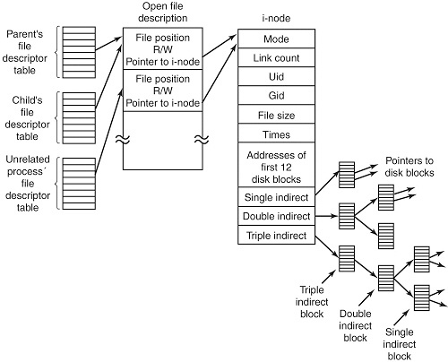

### inode
파일 시스템을 처리할 때 사용하는 특수한 index, i-node = index-node

무언가(파일)를 빠르게 찾기 위한 노드, 파일에 일종의 번호를 부여한 것 + 해당 파일에 대한 정보도 가지고 있음

**특징**
- 파일에 대한 정보(메타데이터)와 인덱스 값을 가진 노드
- 가지고 있는 정보
  1. 파일 노드
  2. 링크 수
  3. 소유자명, 그룹명
  4. 파일 크기, 파일 주소
  5. 마지막 접근 정보, 마지막 수정 정보
  6. 아이노드 수정 정보
- 하나의 파일은 여러 데이터 블록을 가질 수 있다. 아이노드는 모든 블록의 주소를 가리키는 포인터들에 대한 정보를 포함한다.
- 아이노드 안에는 오직 15개의 블록 포인터가 존재하는데, 총 4 종류의 포인터가 있다.
  1. direct pointer(1): 데이터 블록 하나를 point
  2. indirect pointer(12): direct pointer 12개를 point
  3. doubly indirect pointer(1): indirect pointer 12개를 point
  4. triply indirect pointer(1): doubly indirect pointer 12개를 point
=> Inode에 저장할 수 있는 최대 크기는??

<파일 생성>
* 파일 생성 시 inode가 i-list 안에 만들어지며 inode의 inumber와 파일 이름이 디렉토리에 등록됨
* 파일 삭제 시 그 파일에 대한 inode의 파일 링크 수가 1 감소되고 디렉토리 entry 상 해당 파일의 inumber가 0으로 변함
* inode의 파일 링크 수가 0이 되면 파일의 디스크 블록은 free, inode는 dellocate 상태가 됨.

### 하드 링크

- 디렉토리에 그 파일에 대한 새로운 이름이 등록, inumber는 본래 있던 파일의 inumber 복사(동일한 inode 사용)
- ++ 복사되는 파일의 inode 파일의 링크 수 1 증가
- 원본 파일을 삭제해도 파일에 접근할 수 있음

### 심볼릭 링크(소프트 링크)

- 윈도우의 바로가기와 같은 개념 -> 원본 파일을 다른 경로나 이름을 써서 파일을 열 수 있음
- 원본 파일이 삭제되면 파일을 찾을 수 없다. -> 원본의 파일에 의존 

### 1. 하드 링크와 소프트 링크의 차이점

저장 공간
- 하드 링크: 이미 존재하는 데이터의 위치만 point -> 용량 차지 X
- 심볼릭: 파일의 위치를 데이터로 저장(새로운 inode 생성) -> 약간의 용량을 차지

성능
- 하드 링크: 직접 디스크 포인터에 접근 -> 성능 굿
- 심볼릭: 접근을 한 번 거쳐서 함 -> 하드에 비해 성능 bad

파일 위치 이동(같은 파일 시스템의 다른 위치로 이동)
- 하드 링크: 계속 작동
- 심볼릭: 파일 접근 실패

안전성: 심볼릭 < 하드

### 2. 하드 링크와 cp의 차이점
**cp**
- 복사, 원본 파일의 크기와 같은 새로운 파일이 파일 시스템의 공간 차지
- 두 파일은 서로 개별적 & 독립적 -> 서로에게 영향 X

원본 파일 수정 시에 cp로 생성된 파일은 영향받지 않지만 하드 링크의 파일은 원본 파일의 수정 사항이 반영됨.

*참고*
https://i5i5.tistory.com/341

