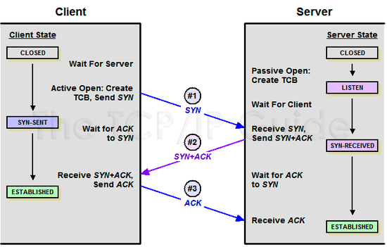
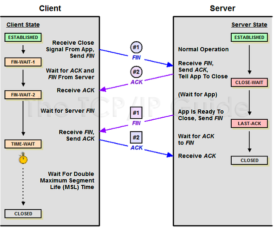
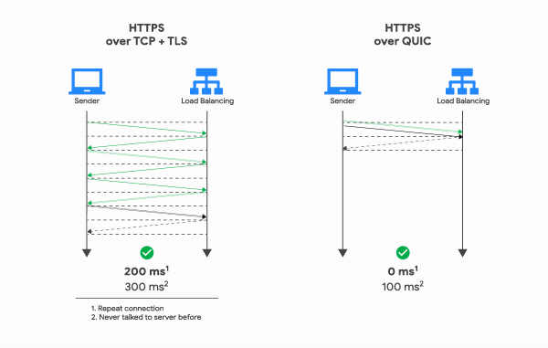
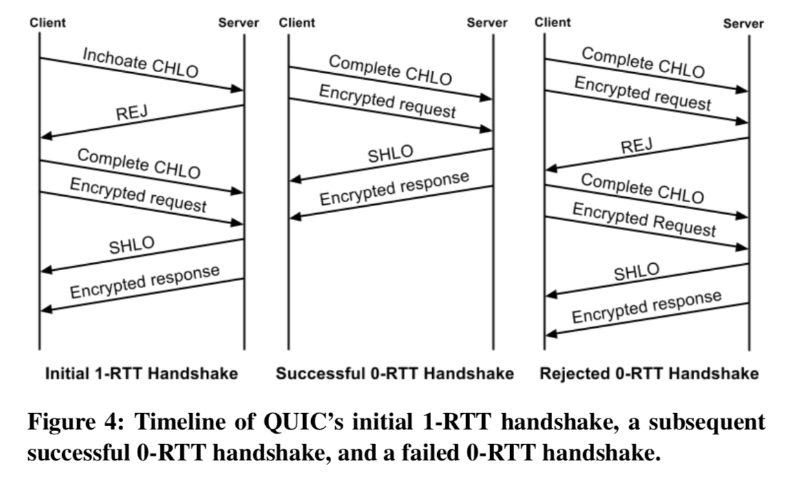
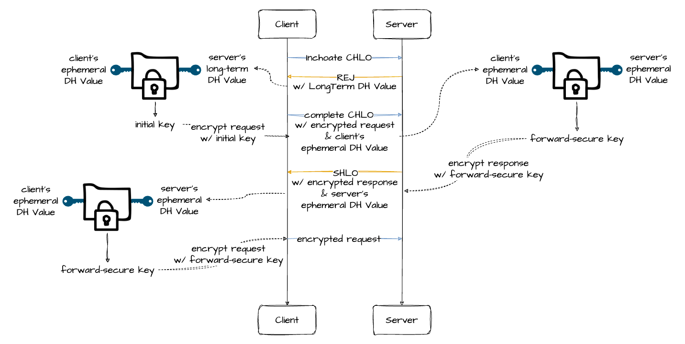
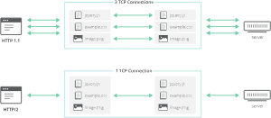

##  HTTP 3.0 (HTTP/3)
HTTP/2는 여전히 TCP 사용 -> 초기 연결에 대한 RTT로 인한 지연 시간이라는 문제점

이를 해결한 버전이 HTTP/3

### 소개
- 처음에는 HTTP-over-QUIC이라는 이름, IEFT(Internet Engineering Task Force)
의 마크 노팅엄이 프로토콜의 이름을 HTTP/3로 변경할 것을 제안, 2018년 11월에 HTTP/3로 변경
- QUIC(Quick UDP Internet Connection) 프로토콜 위에서 돌아가는 HTTP -> UDP를 사용

### TCP가 느리다?
- TCP: 신뢰성이 높고 느리다, UDP: 신뢰성이 낮고 빠르다. (신뢰성: 데이터 패킷들의 순서, 유실 여부 등을 검사하여 모든 데이터가 
수신 측에 온전하게 전달 되는지)
- TCP의 신뢰성에 의한 overhead
  - 통신 시작 시 3 Way Handshake
  
  - 통신 종료 시 4 Way Handshake
  
  - HOLB(Head of line Blocking)
    - TCP 사용 통신 시 패킷은 무조건 정확한 순서대로 처리되어야 한다.
    - 송신 측은 수신 측이 패킷을 제대로 다 받았다는 것을 확인한 후, 유실된 패킷 존재 시 다시 전송해야 함
    - 패킷 처리 순서 또한 정해져 있기 때문에 이전에 받은 패킷을 파싱하기 전까지 다음 패킷 처리 불가
    - 이렇게 패킷 유실 또는 파싱 속도에 의해 통신에 병목이 발생하게 되는 현상을 HOLB라 함.

### 왜 QUIC이어야 했을까?
1. 왜 새로운 전송 레이어를 만들지 않았나?
  배포의 어려움: 커널의 업데이트 요구, 모든 중간 미들박스에서 이를 통과시켜줘야 한다. 보안 측면으로 익숙하지 않은 패킷의 형태가 통과되지 않을 가능성
2. 왜 TCP 업데이트를 하지 않았나?
  위와 유사한 문제: OS 업데이트 요구, 네트워크 경로의 미들박스들이 모두 커널을 업데이트 해야 한다. + 기존 TCP와 강하게 바인딩 된 소프트웨어로 동작하는 경우 문제 발생 여지
3. 왜 UDP인가?
  TCP 사용 시 비효율적 Handshake, HOL Blocking 등 근본적인 문제와 직면

### QUIC과 UDP
**설계 목표**
- Deployablility: 기존 시스템이 온전히 인식할 수 있어야 함.
- Security: 기존 TLS 암호화 과정처럼 데이터를 안전히 전달.
- Reduction in Handshake: 기존 TLS/TCP 스택의 Handshake 비효율 문제 해결
- HOL Blocking: 멀티플렉싱 되는 데이터가 HOL Blocking 문제를 맞이해선 안됨.

+) TCP처럼 신뢰성 있는 전달, 흐름 제어 및 혼잡 제어 등 처리

**UDP는 하얀 도화지 같은 프로토콜**
- 데이터그램 방식 사용 -> 각 패킷 간의 순서 존재 X,
- 독립적인 패킷 사용목적지만 정해져있다면 중간 경로 신경 X, 종단 간의 연결 설정 X -> handshake 과정 필요 X
- 데이터 전송을 제외한 그 어떤 기능도 정의되어 있지 않음.
- TCP의 경우 기능이 많기 때문에 이미 헤더가 꽉 차 있어 다른 추가 기능을 구현하려면 옵션 필드를 사용해야 하는데, 
무한정 배당할 수 없으므로 크기가 320 bits로 정해져 있다.
- TCP의 단점을 보완하기 위해 나중에 정의된 MSS(Maximum Segment Size), WSCALE(Window Scale factor), SACK(Selective ACK) 등
많은 옵션들이 이미 옵션 필드를 차지하고 있기 때문에 실질적으로 사용자가 커스텀 기능을 구현할 수 있는 자리는 거의 남지 않음.
- UDP의 헤더: 출발지와 도착지, 패킷의 길이, 체크섬(사용해도 되고 안해도 되는 옵션)
=> 개발자가 구현을 어떻게 하냐에 따라 TCP와 비슷한 수준의 기능을 가질 수 있다.
- TCP: 좋은 기능이 다 들어있는 무거운 라이브러리 **vs** UCP: 필요한 기능만 들어있는 가벼운 라이브러리

### UDP 사용에 의한 개선점
**연결 설정 시 레이턴시 감소**
- 3 Way Handshake 과정 불필요
- TCP는 연결 생성 시 기본적으로 1RTT가 필요하고, TLS를 사용한 암호화 시 3RTT 필요
- QUIC은 첫 연결 설정에 1RTT만 소요(TCP와 달리 암호화 통신을 위한 Handshake 과정 통합)

- QUIC의 Handshake

- **Initial handshake**
  - Inchoate CHLO: 서버의 정보를 얻어 오기 위한 가장 첫 요청, Client Hello 단계
  - REJ: reject, 클라이언트의 메시지가 응답을 보내기에 부적합한 경우 서버가 보내는 메세지
    - 서버의 설정(서버의 장기 DH 공개키 등), 인증서와 시그니처, 클라이언트의 공개 IP 주소와 서버의 타임스탬프가 포함된 인증 암호 블록 포함
- **Final handshake**
  - 서버의 장기 키와 클라이트의 임시 키를 이용해 비밀 키(initial key) 생성
  - Complete CHLO: initial key로 암호화한 메시지와 임시 키를 전송
  - 이 메시지를 받은 서버가 복호화에 성공하고 Handshake가 성공적으로 되면 SHLO라는 메시지 전송
  - SHLO: 서버의 장기 키가 아니라 임시 키로 만든 비밀 키를 사용해 응답 암호화 -> 클라이언트의 임시 키와 서버의 임시 키로 새로운 비밀 키(forward-secure key) 생성
      서버의 임시 키를 포함 -> 클라이언트 역시 forward-secure key 생성 가능 -> 이후 forward-secure key를 통해 암호화&복호화
  
  - 한번 연결에 성공하면 서버 설정 및 소스 주소 토큰을 캐싱, 다음 연결 때 캐싱해둔 설정을 사용하여 바로 연결 설정(Complete CHLO) -> 0-RTT로 바로 통신 시작 가능
- **Version Negotiation**
  - QUIC 클라이언트와 서버는 커넥션이 일어나는동안 버전 협상을 함.
  - 클라이언트는 첫번째 패킷에 사용할 버전을 명시 -> 서버가 사용할 수 없는 버전을 가지고 있다면 서버는 사용가능한 모든 버전을 담아 협상 패킷 전송
  - 이 과정은 RTT 딜레이를 만드는 원인이 된다.
- 관련 동영상: https://www.youtube.com/watch?v=vXgbPZ-1-us

**멀티플렉싱 지원**
- HOLB를 방지하기 때문에 매우 중요!!
- 여러 개의 TCP 연결을 만드는 것이 아니라 단일 연결 안에서 여러 개의 데이터를 섞이지 않게 보내는 기법, 각각의 데이터 흐름: 스트림
- HTTP/2와 동일하게 멀티플렉싱을 지원한다.

- QUIC의 스트림
  - 신뢰성 있는 양방향으로 바이트 스트림을 전달하는 가벼운 논리적 스트림
  - 최대 2^64 바이트의 임의 크기 메시지를 전달 가능, 가볍기 때문에 여러 스트림 동시 동작 가능
  - 스트림 ID를 통해 구분 -> 서버에서 시작되는 경우 짝수 아이디, 클라이언트에서 시작되는 경우 홀수 아이디로 충돌 방지
  - 첫번째 바이트 전송 시 생성, 양측에서 마지막 스트림 프레임에 FIN 플래그 비트를 찍음으로 종료 -> 커넥션 자체를 파괴하지 않으면서 스트림 취소 가능

**패킷 손실 감지에 걸리는 시간 단축**
- TCP: Stop and Wait ARQ 방식 사용 -> 송신 측이 패킷을 보낸 후 타이머를 사용하여 시간을 재고, 일정 시간 경과 후 적절한 답변 없을 시 손실된 것으로 판단하여 다시 전송하는 방식
    RTO(Retransmission Time Out): 패킷 손실 감지를 위해 얼마나 기다릴 것인가 -> 동적으로 계산해야 함
    패킷에 시퀀스 번호 부여, 손실 복구 작업 시 이 패킷의 시퀀스 번호 사용 -> 서버가 ACK 응답을 보낼 때 받았던 패킷의 번호를 그대로 사용하므로 재전송 패킷에 대한 ACK 응답인지
오리지널 패킷에 대한 ACK 응답인지 알지 못한다 -> 재전송 모호 문제(Retransmission Ambiguity Problem)
- QUIC: 헤더에 별도의 패킷 번호 공간 부여 -> 패킷의 전송 순서를 나타냄, 매 전송마다 모노토닉하게 패킷 번호가 증가하기 때문에 패킷의 전송 순서를 명확하게 파악 가능
    - https://datatracker.ietf.org/doc/rfc9002/ 의 3.1 Relevant Differences Between QUIC and TCP 읽어보기....!

**흐름 제어와 혼잡 제어**
- 흐름 제어
  - 커넥션 자체의 모든 스트림들이 가지고 있는 버퍼의 총량에 대한 흐름 제어 & 스트림마다 소비하는 버퍼의 흐름 제어
  - 특정 스트림을 소비하는 속도가 느리다면 해당 스트림이 전체에 차지하는 버퍼 제한
  - 기본적으로 윈도우 사이즈는 패킷을 주고받을 때마다 증가, 두 흐름 제어 동일하게 동작
- 혼잡 제어의 경우 특정하는 바 X
  - 인터페이스 제공, 해당 인터페이스를 구현한 혼잡 제어 알고리즘 사용 가능
  - 구글 배포 상태: TCP & QUIC 모두 Cubic을 혼잡 제어 컨트롤러로 사용

**클라이언트의 IP가 바뀌어도 연결 유지**
- TCP: 소스의 IP 주소와 포트, 연결 대상의 IP 주소와 포트로 연결 식별 -> 클라이언트의 IP 변경 시 연결 끊김
- 최근 모바일로 인터넷을 사용하는 경우 대다수, Wifi <-> 셀룰러 & 다른 Wifi 연결 경우와 같이 클라이언트의 IP가 변경되는 일이 잦아짐
- QUIC: Connection ID(64bit)를 사용하여 서버와 연결 생성, Connection ID는 랜덤한 값일 뿐, 클라이언트의 IP와는 무관한 데이터 -> IP가 변경되어도 기존 연결 유지 가능

***참고 자료***
- https://evan-moon.github.io/2019/10/08/what-is-http3/
- https://changhoi.kim/posts/network/about-http3/