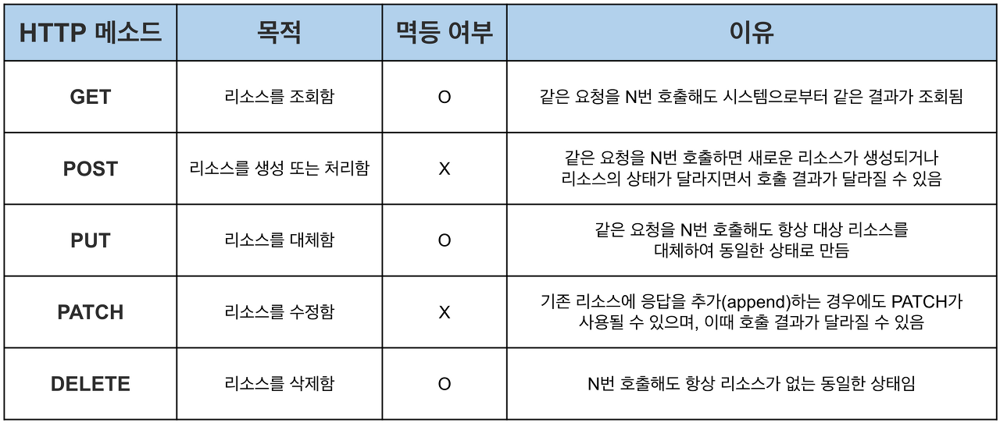

## HTTP 메소드

### GET
- 특정 리소스의 representation 요청
- 쿼리 스트링을 통해 데이터 전달

### POST
- 특정 리소스에 entity 제출, 종종 서버의 상태 변화나 side effect 발생
- 전달한 데이터 처리/생성 요청 메소드
- 메시지 바디를 통해 데이터 전달

### HEAD
- GET 요청과 동일한 응답 요청, response body 빼고
- 응답의 상태 코드만 확인 등 일종의 검사 용도로 사용

### PUT
- 타겟 리소스의 모든 current representation을 요청 payload로 대체
- 기존 리소스가 2개의 필드를 가지고 있는데 하나의 필드에 대해서만 요청할 경우 나머지 필드 삭제

### DELETE
- 특정 리소스 삭제

### CONNECT
- 타겟 리소스로 특정되는 서버로 tunnel 수립

### OPTIONS
- 타겟 리소스의 communication options describe
- 예비 요청(본 요청 전 미리 검사)에 사용되는 메소드
- 서버의 지원 가능한 메소드와 출처를 응답 받아 CORS 정책을 검사하기 위한 요청

### TRACE
- 타겟 리소스로의 path 따라 message loop-back test 시행
- 일종의 검사용, 서버에 도달했을 때 최종 패킷의 요청 패킷 내용을 응답 받을 수 있다.
- Body 포함 X

### PATCH
- 리소스로의 부분적 수정 적용
- 리소스 일부 부분만 변경

### 멱등성
**HTTP 메소드의 멱등성이란?**
- 여러 번 동일한 요청을 보냈을 때, 서버에 미치는 의도된 영향이 동일한 경우

**HTTP 메소드의 멱등성이 필요한 이유**
- 요청의 재시도 때문
- HTTP 요청이 멱등하다면 요청이 실패한 경우 주저없이 재시도 요청 가능
- HTTP 요청이 멱등하지 않다면 리소스가 이미 처리되었는데 중복 요청을 보낼 수 있음
- 따라서 멱등성을 고려하여 재시도 요청을 해야 함.

**HTTP 메소드의 멱등 여부**

- GET 요청에 장애 발생
  - ex) GET 요청 중복으로 로그가 지나치게 많이 저장되어 문제 
    -> 서버에 문제는 발생했지만 해당 문제는 HTTP 메소드의 구현에 따른 side effect, 장애는 서버에서 발생 & 리소스에는 영향이 없음 -> GET 요청은 멱등
  - 멱등성은 오직 사용자 요청에 의한 리소스만을 고려, 구현에 따른 부작용 고려 X
  - +) 재요청 중간에 리소스가 변경된 것 역시 고려하지 않음
- PATCH 메소드가 멱등하지 않은 이유
  - PATCH가 보다 범용적으로 사용 -> 값을 추가하는 요청 역시 PATCH 사용
  - ex) PATCH {operation: append, name: "MangKyu"} * 3
    name: ["MangKyu"] -> name: ["MangKyu", "MangKyu"] -> name: ["MangKyu", "MangKyu", "MangKyu"]
- DELETE 메소드가 멱등한 이유
  - 자원이 있는 상태에서 삭제 요청을 보낸 경우 첫 요청에는 200, 후의 동일한 요청에는 404?
  - 멱등성의 기준은 상태 코드 X
  - DELETE를 여러 번 호출해도 응답 상태와 무관하게 리소스가 없는 상태를 유지 -> 멱등

- 멱등성은 **리소스**의 관점에서 생각하는 것이 중요!

**참고 자료**
- https://developer.mozilla.org/en-US/docs/Web/HTTP/Methods
- https://inpa.tistory.com/entry/WEB-%F0%9F%8C%90-HTTP-%EB%A9%94%EC%84%9C%EB%93%9C-%EC%A2%85%EB%A5%98-%ED%86%B5%EC%8B%A0-%EA%B3%BC%EC%A0%95-%F0%9F%92%AF-%EC%B4%9D%EC%A0%95%EB%A6%AC
- https://mangkyu.tistory.com/251
