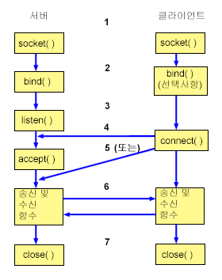

## 소켓 동작 방식

소켓: 일반적으로 클라이언트와 서버의 상호작용에 사용

소켓의 일반적인 이벤트 흐름

1. socket() API: 통신을 위한 endpoint 작성, 해당 endpoint를 나타내는 소켓 설명자 return
2. app은 소켓 설명자 획득 후 해당 소켓에 고유 이름 바인드 가능, 네트워크에 접근하기 위해서는 서버가 이름을 바인드해야 함.
3. listen(): 클라이언트 연결 요청을 받아들이려는 의사 표시
4. connect(): 클라이언트가 서버에 대한 연결 설정
5. accept(): 클라이언트 연결 요청을 승인
6. 소켓 간 연결 설정 -> 모든 소켓 API + 데이터 전송 API 사용 가능
7. 중단 시 close()

**bind()**
- 소켓에 주소 할당
- socket() 함수를 통해 받아온 디스크립터 sockfd 존재, 이 디스크립터 파일에 해당하는 소켓에 serv_addr 주소 할당
- 성공시 0, 실패시 -1 반환

**listen()**
- 연결 요청 대기
- 함수가 호출된 후부터 클라이언트에서 connect를 호출할 수 있게 됨.
- backlog: 연결요청을 대기하는 큐의 크기

**accept()**
- 연결 요청을 수락
- 반환값은 성공/실패에 대한 정수값이 아닌, 새로운 디스크립터 번호
- accept()를 통해 새로 할당받은 소켓을 이용해 데이터 송수신

***참고 자료***
- https://www.ibm.com/docs/ko/i/7.3?topic=programming-how-sockets-work
- https://velog.io/@minji/%EC%86%8C%EC%BC%93%ED%94%84%EB%A1%9C%EA%B7%B8%EB%9E%98%EB%B0%8D-bind-listen-accept